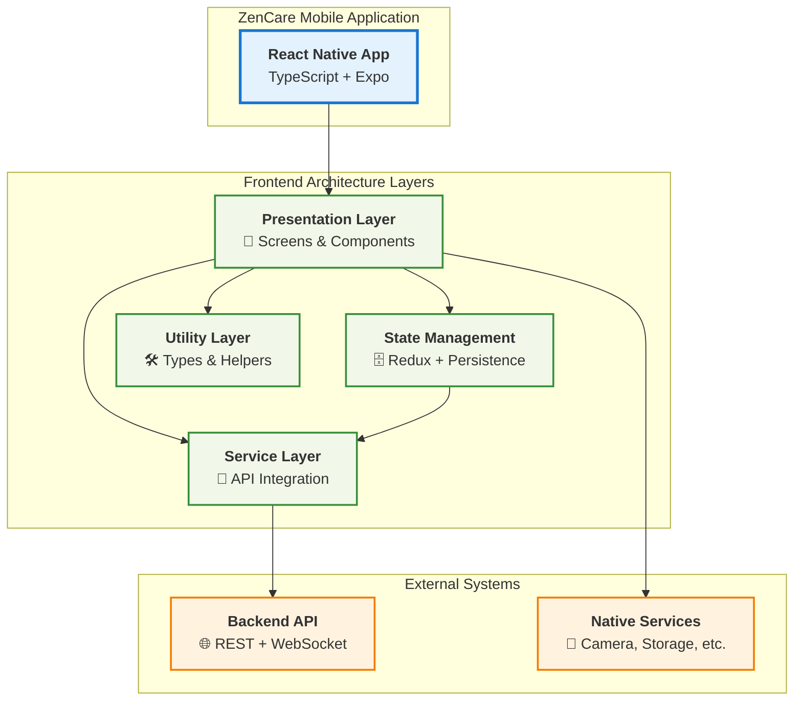
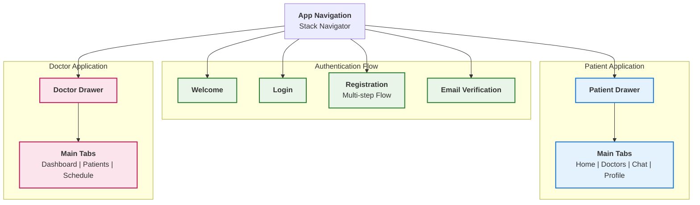
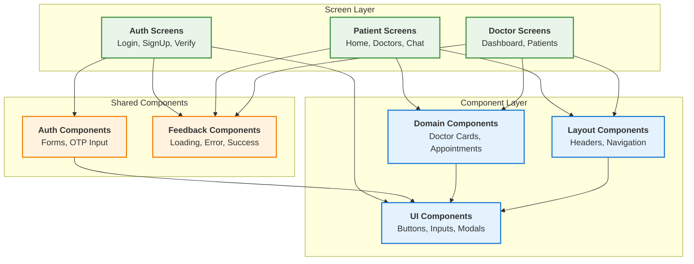
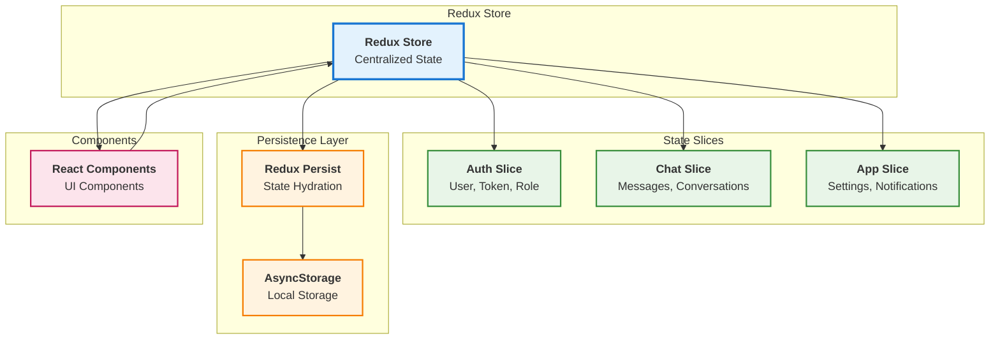
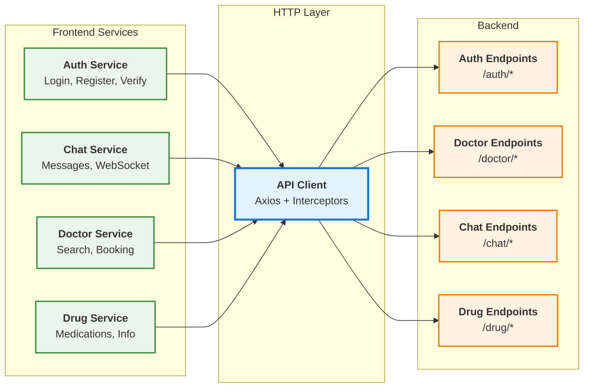
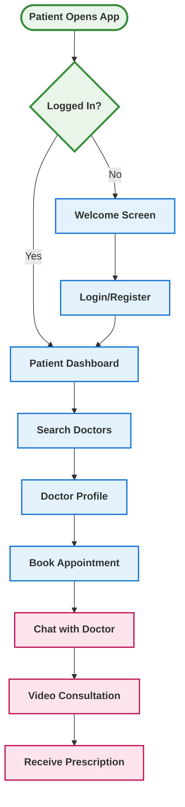
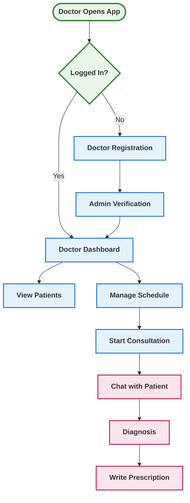
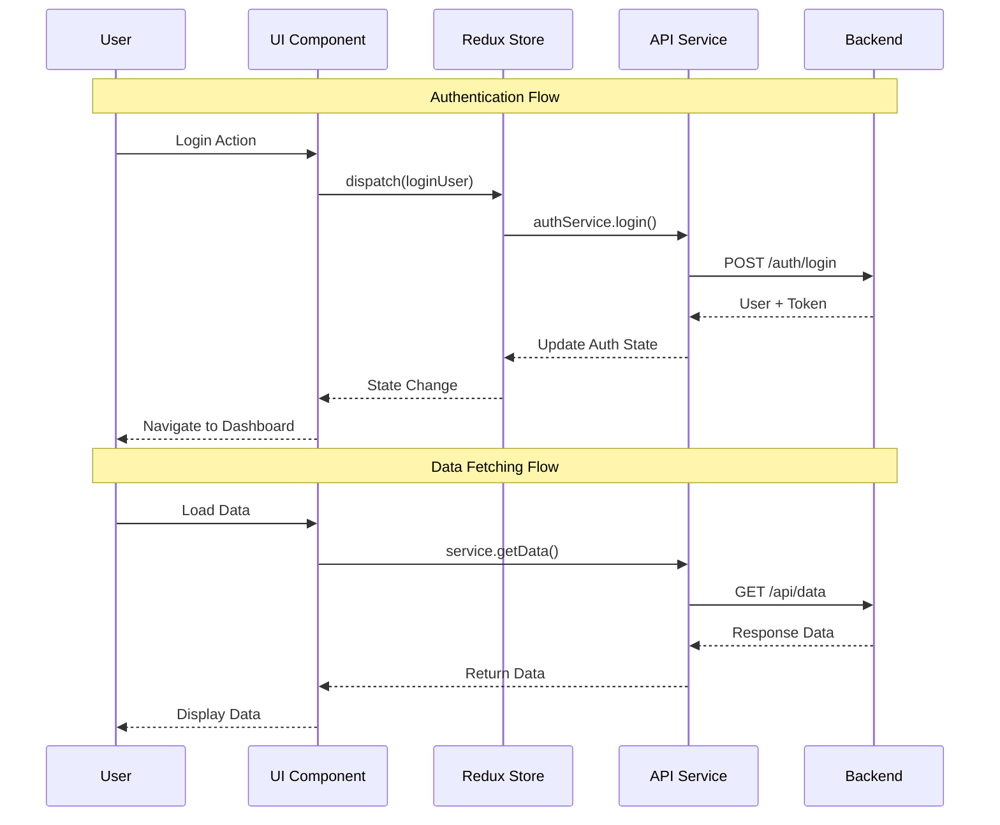

# ZenCare Frontend Architecture Diagrams - For Graduation Project Book

This file contains simplified Mermaid diagrams designed to fit on individual pages in your graduation project documentation.

## Diagram 1: Overall System Architecture (Page 1)

## Diagram 2: Navigation Structure (Page 2)

## Diagram 3: Component Architecture (Page 3)

## Diagram 4: State Management (Page 4)

## Diagram 5: API Integration (Page 5)

## Diagram 6: User Flow - Patient Journey (Page 6)

## Diagram 7: User Flow - Doctor Journey (Page 7)

## Diagram 8: Data Flow Architecture (Page 8)

## Usage Instructions for Graduation Project Book

1. **Copy each diagram code separately** into Mermaid Live Editor
2. **Export as PNG or SVG** with high resolution for print quality
3. **Recommended settings**:

   - PNG: 300 DPI minimum
   - SVG: Vector format (best for scaling)
   - Size: Fit to page width in your document

4. **Suggested page layout**:

   - One diagram per page
   - Add diagram title and brief description
   - Include page numbers for cross-referencing

5. **Chapter organization**:
   - **Chapter X.1**: Overall Architecture (Diagram 1)
   - **Chapter X.2**: Navigation Structure (Diagram 2)
   - **Chapter X.3**: Component Architecture (Diagram 3)
   - **Chapter X.4**: State Management (Diagram 4)
   - **Chapter X.5**: API Integration (Diagram 5)
   - **Chapter X.6**: Patient User Flow (Diagram 6)
   - **Chapter X.7**: Doctor User Flow (Diagram 7)
   - **Chapter X.8**: Data Flow (Diagram 8)

Each diagram is optimized for:

- ✅ Single page display
- ✅ Clear, readable text
- ✅ Professional academic presentation
- ✅ Print-friendly colors
- ✅ Logical information density
