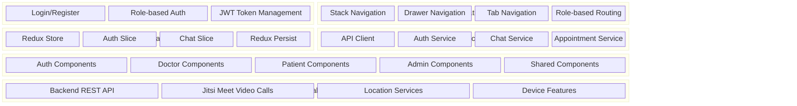
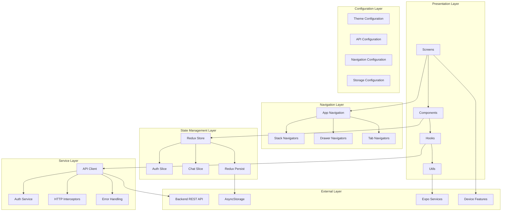
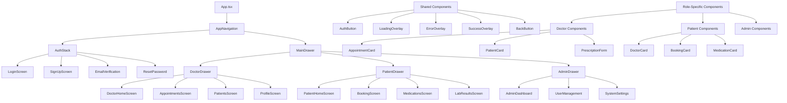
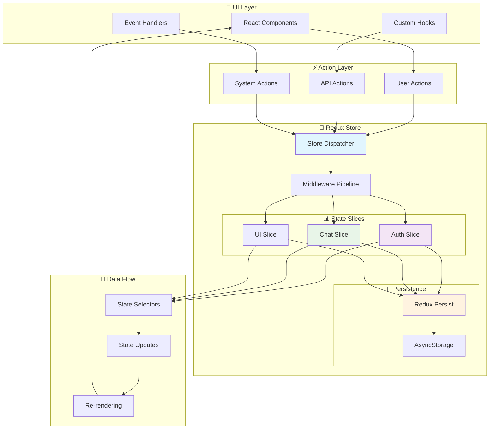
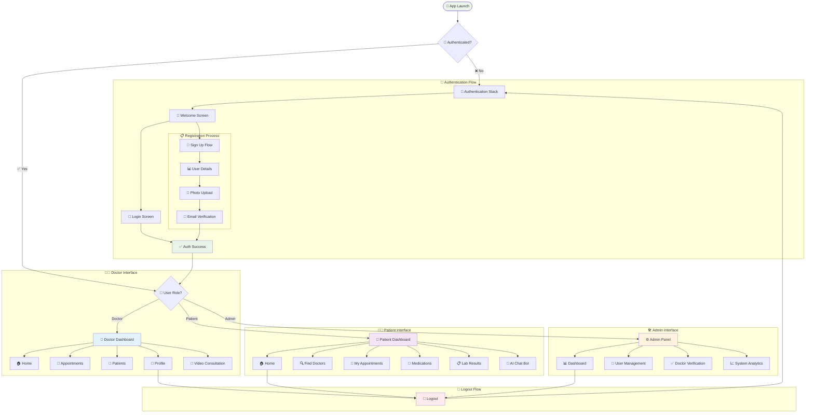
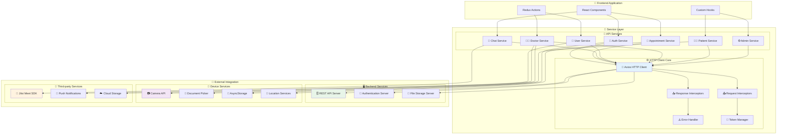
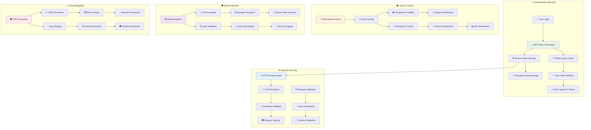
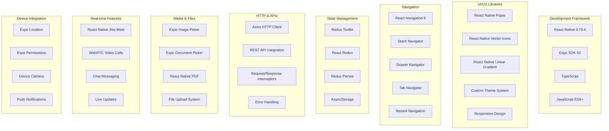

# ZenCare Frontend Architecture Documentation

## 1. System Overview Diagram

This diagram shows the high-level architecture of the ZenCare mobile application built with React Native and Expo.

**Description:**
The ZenCare frontend follows a layered architecture pattern with clear separation of concerns. The application is built using React Native with Expo framework, providing cross-platform compatibility. The architecture consists of five main layers: Authentication for user security, Navigation for routing, State Management using Redux, Service Layer for API communication, and UI Components for user interface. Each layer communicates through well-defined interfaces ensuring modularity and maintainability.

## 2. Application Layers Architecture

This diagram illustrates the detailed layer structure and data flow within the application.

**Description:**
The application follows a six-layer architecture ensuring clear separation of concerns and maintainability. The Presentation Layer handles user interface and interactions, Navigation Layer manages routing between screens, State Management Layer controls application state using Redux, Service Layer handles external communications, Configuration Layer manages app settings, and External Layer interfaces with backend services and device features. Data flows unidirectionally from external sources through services to state management and finally to the presentation layer.

## 3. Component Architecture Diagram

This diagram shows the hierarchical structure of React Native components and their relationships.

**Description:**
The component architecture follows a hierarchical structure with App.tsx as the root component. Navigation components control the flow between different user roles (Doctor, Patient, Admin). Each role has dedicated screens and components tailored to their specific needs. Shared components provide common functionality across the application, while role-specific components handle specialized features. This structure promotes code reusability and maintains clear separation between different user experiences.

## 4. State Management Flow Diagram

This diagram illustrates how Redux manages application state and data flow.

**Description:**
The state management system uses Redux Toolkit for predictable state updates. Components dispatch actions to the Redux store, which processes them through reducers to update the application state. The Auth Slice manages user authentication and authorization data, while the Chat Slice handles real-time messaging state. Redux Persist ensures critical data like authentication tokens survive app restarts by storing them in AsyncStorage. Middleware handles cross-cutting concerns like data persistence and serialization checks.

## 5. Navigation Flow Diagram

This diagram shows the navigation structure and user flow through the application.

**Description:**
The navigation system implements role-based routing with conditional flows based on user authentication and role. Unauthenticated users access the Auth Stack containing login and registration flows. Upon successful authentication, users are routed to role-specific drawer navigations. Each role (Doctor, Patient, Admin) has customized screens and functionality. The system ensures secure access control and smooth user experience transitions between different application states.

## 6. Service Layer Architecture

This diagram details the service layer responsible for external communications and data management.

**Description:**
The service layer acts as an abstraction between the application logic and external dependencies. API services handle specific domain operations while the API client core manages HTTP communications with the backend. Request and response interceptors handle cross-cutting concerns like authentication tokens and error logging. External services integration provides specialized functionality like video calling and location services. Device integration ensures seamless access to native device capabilities while maintaining platform compatibility.

## 7. Security Architecture Diagram

This diagram illustrates the security measures implemented in the frontend application.

**Description:**
The security architecture implements multiple layers of protection to ensure user data safety and application integrity. Authentication uses JWT tokens stored securely in encrypted AsyncStorage. API communications are protected through HTTPS with token-based authentication and automatic session management. Role-based access control restricts user capabilities based on their privileges. Input validation and type safety prevent injection attacks and data corruption. Network security ensures encrypted data transmission, while privacy protection minimizes data exposure and implements secure cleanup procedures.

## 8. Technology Stack Diagram

This diagram shows the complete technology stack used in the frontend development.

**Description:**
The technology stack represents a modern, cross-platform mobile development approach using React Native and Expo. The framework provides native performance with JavaScript development efficiency. UI libraries ensure consistent design language and responsive layouts. Navigation libraries handle complex routing scenarios with nested navigators. State management uses Redux for predictable data flow. HTTP integration enables seamless backend communication. Media libraries support file handling and document management. Real-time features enable video consultations and instant messaging. Device integration provides access to native capabilities while maintaining cross-platform compatibility.

---

## Summary

These diagrams collectively represent the comprehensive frontend architecture of the ZenCare mobile application. The architecture emphasizes:

- **Modularity**: Clear separation of concerns across different layers
- **Scalability**: Extensible structure for future feature additions
- **Security**: Multi-layered security approach for data protection
- **Performance**: Optimized state management and navigation
- **Maintainability**: Well-organized component hierarchy and service architecture
- **User Experience**: Role-based interfaces with intuitive navigation flows

The architecture supports three distinct user roles (Doctor, Patient, Admin) while maintaining code reusability through shared components and services. The technology stack ensures cross-platform compatibility and modern development practices.
