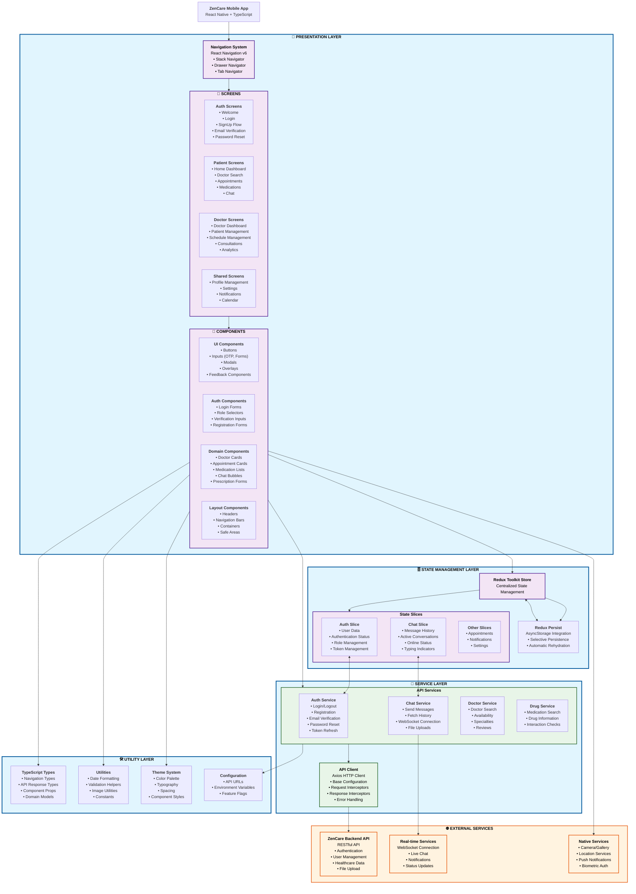
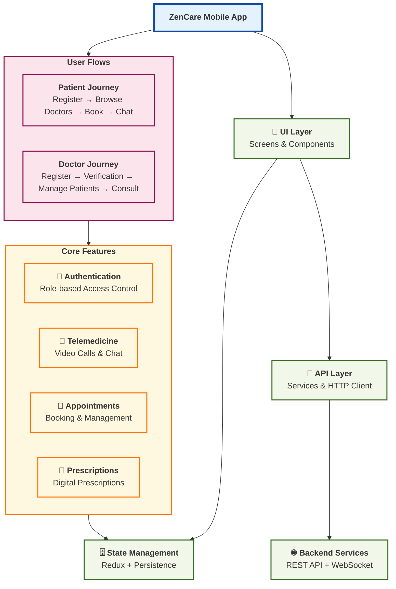
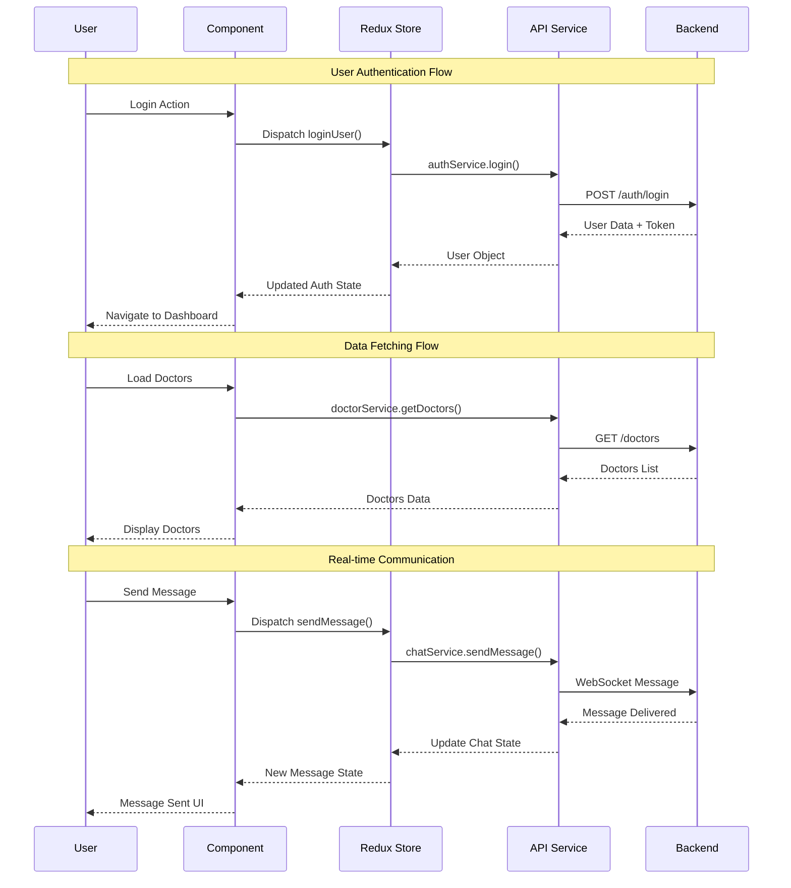

# ZenCare Frontend Architecture - Mermaid Component Diagram

## Component Diagram Code

Copy and paste this code into [Mermaid Live Editor](https://mermaid.live/) to visualize the architecture:

## Simplified High-Level Architecture Diagram

For a more concise overview, here's a simplified version:

## Data Flow Diagram

## Usage Instructions

1. **For Documentation**: Copy the first comprehensive diagram code into Mermaid Live Editor
2. **For Presentations**: Use the simplified high-level diagram
3. **For Technical Discussions**: Use the data flow sequence diagram
4. **For Development**: Reference the detailed architecture documentation above

The diagrams are designed to be rendered in Mermaid Live Editor and can be exported as SVG, PNG, or embedded in documentation.
