# ZenCare Frontend Architecture - Mermaid Diagrams

## 1. Overall System Architecture

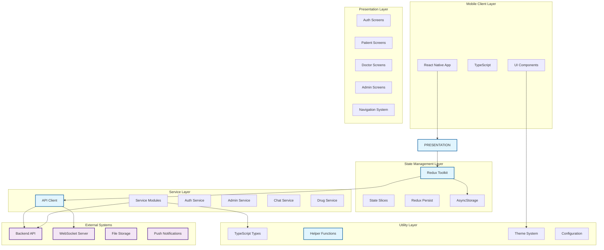

## 2. Architecture Layers Breakdown

### 2.1 Presentation Layer Architecture

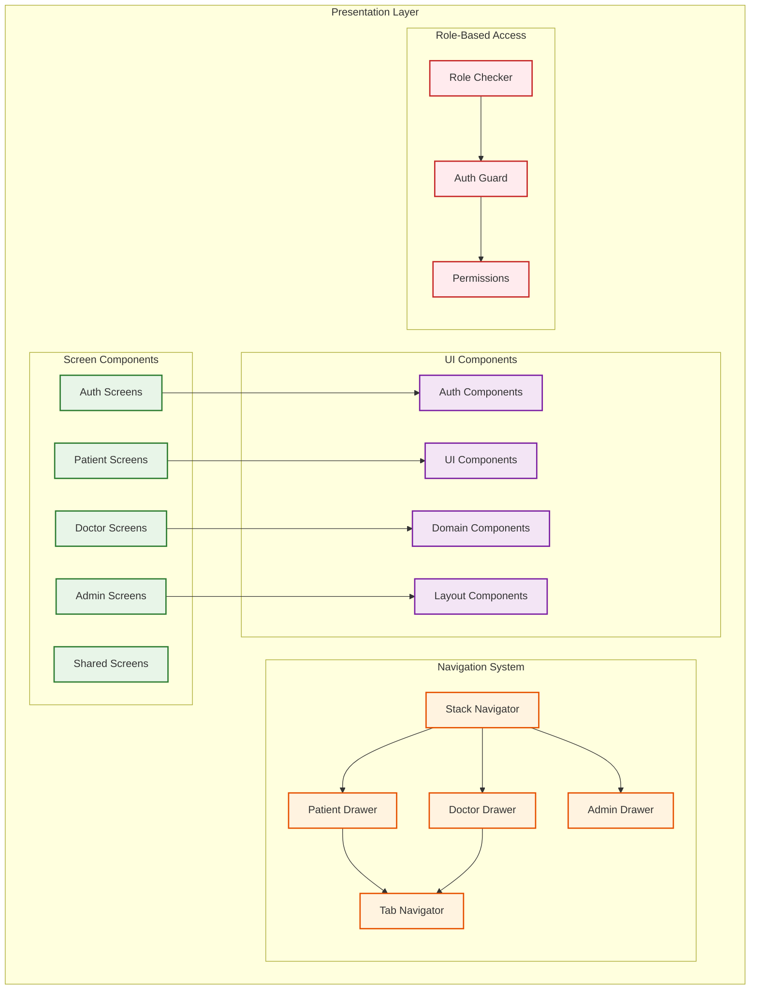

### 2.2 State Management Layer Architecture

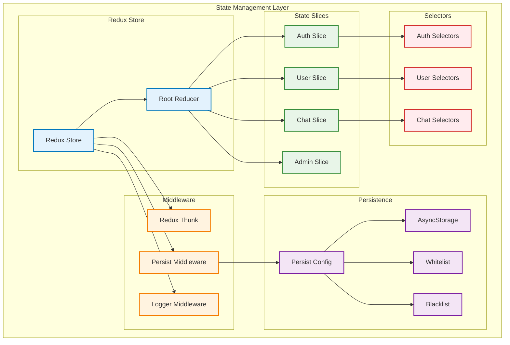

### 2.3 Service Layer Architecture

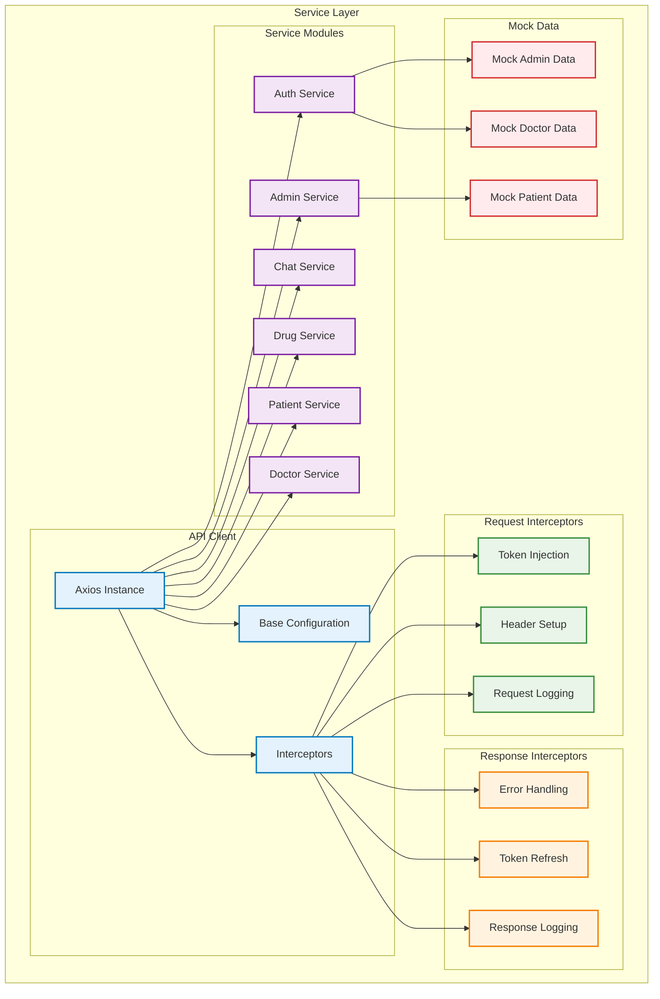

### 2.4 Utility Layer Architecture

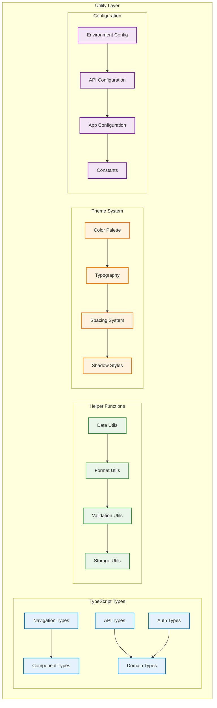

## 3. Navigation Flow Diagrams

### 3.1 Complete Navigation Structure

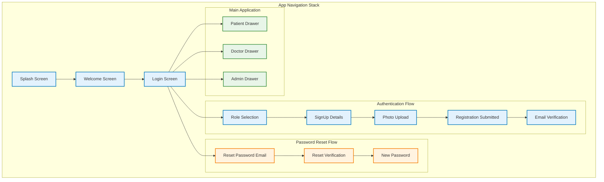

### 3.2 Role-Based Navigation

```mermaid
graph TB
    subgraph "User Authentication"
        LOGIN_CHECK{Login Success?}
        ROLE_CHECK{User Role?}
    end

    subgraph "Patient Navigation"
        PATIENT_DRAWER[Patient Drawer]
        PATIENT_TABS[Patient Tabs]
        HOME_TAB[Home Tab]
        CALENDAR_TAB[Calendar Tab]
        AI_BOT_TAB[AI Bot Tab]
        MEDS_TAB[Medications Tab]
        PROFILE_TAB[Profile Tab]

        PATIENT_SCREENS[Patient Screens]
        APPOINTMENTS[Appointments]
        MEDICAL_HISTORY[Medical History]
        PRESCRIPTIONS[Prescriptions]
        TELEMEDICINE[Telemedicine]
    end

    subgraph "Doctor Navigation"
        DOCTOR_DRAWER[Doctor Drawer]
        DOCTOR_HOME[Doctor Home]
        DOCTOR_DASHBOARD[Doctor Dashboard]
        DOCTOR_APPOINTMENTS[Doctor Appointments]
        DOCTOR_PATIENTS[Doctor Patients]
        DOCTOR_PROFILE[Doctor Profile]
        AVAILABILITY[Availability]
    end

    subgraph "Admin Navigation"
        ADMIN_DRAWER[Admin Drawer]
        ADMIN_VERIFICATION[Doctor Verification]
        ADMIN_DASHBOARD[Admin Dashboard]
        ADMIN_SETTINGS[Admin Settings]
    end

    LOGIN_CHECK -->|Yes| ROLE_CHECK
    ROLE_CHECK -->|Patient| PATIENT_DRAWER
    ROLE_CHECK -->|Doctor| DOCTOR_DRAWER
    ROLE_CHECK -->|Admin| ADMIN_DRAWER

    PATIENT_DRAWER --> PATIENT_TABS
    PATIENT_TABS --> HOME_TAB
    PATIENT_TABS --> CALENDAR_TAB
    PATIENT_TABS --> AI_BOT_TAB
    PATIENT_TABS --> MEDS_TAB
    PATIENT_TABS --> PROFILE_TAB

    PATIENT_DRAWER --> PATIENT_SCREENS
    PATIENT_SCREENS --> APPOINTMENTS
    PATIENT_SCREENS --> MEDICAL_HISTORY
    PATIENT_SCREENS --> PRESCRIPTIONS
    PATIENT_SCREENS --> TELEMEDICINE

    DOCTOR_DRAWER --> DOCTOR_HOME
    DOCTOR_DRAWER --> DOCTOR_DASHBOARD
    DOCTOR_DRAWER --> DOCTOR_APPOINTMENTS
    DOCTOR_DRAWER --> DOCTOR_PATIENTS
    DOCTOR_DRAWER --> DOCTOR_PROFILE
    DOCTOR_DRAWER --> AVAILABILITY

    ADMIN_DRAWER --> ADMIN_VERIFICATION
    ADMIN_DRAWER --> ADMIN_DASHBOARD
    ADMIN_DRAWER --> ADMIN_SETTINGS

    classDef patient fill:#e8f5e8,stroke:#388e3c,stroke-width:2px
    classDef doctor fill:#e3f2fd,stroke:#0277bd,stroke-width:2px
    classDef admin fill:#ffebee,stroke:#d32f2f,stroke-width:2px
    classDef decision fill:#fff3e0,stroke:#f57c00,stroke-width:2px

    class PATIENT_DRAWER,PATIENT_TABS,HOME_TAB,CALENDAR_TAB,AI_BOT_TAB,MEDS_TAB,PROFILE_TAB,PATIENT_SCREENS,APPOINTMENTS,MEDICAL_HISTORY,PRESCRIPTIONS,TELEMEDICINE patient
    class DOCTOR_DRAWER,DOCTOR_HOME,DOCTOR_DASHBOARD,DOCTOR_APPOINTMENTS,DOCTOR_PATIENTS,DOCTOR_PROFILE,AVAILABILITY doctor
    class ADMIN_DRAWER,ADMIN_VERIFICATION,ADMIN_DASHBOARD,ADMIN_SETTINGS admin
    class LOGIN_CHECK,ROLE_CHECK decision
```

## 4. Data Flow Diagrams

### 4.1 Authentication Data Flow

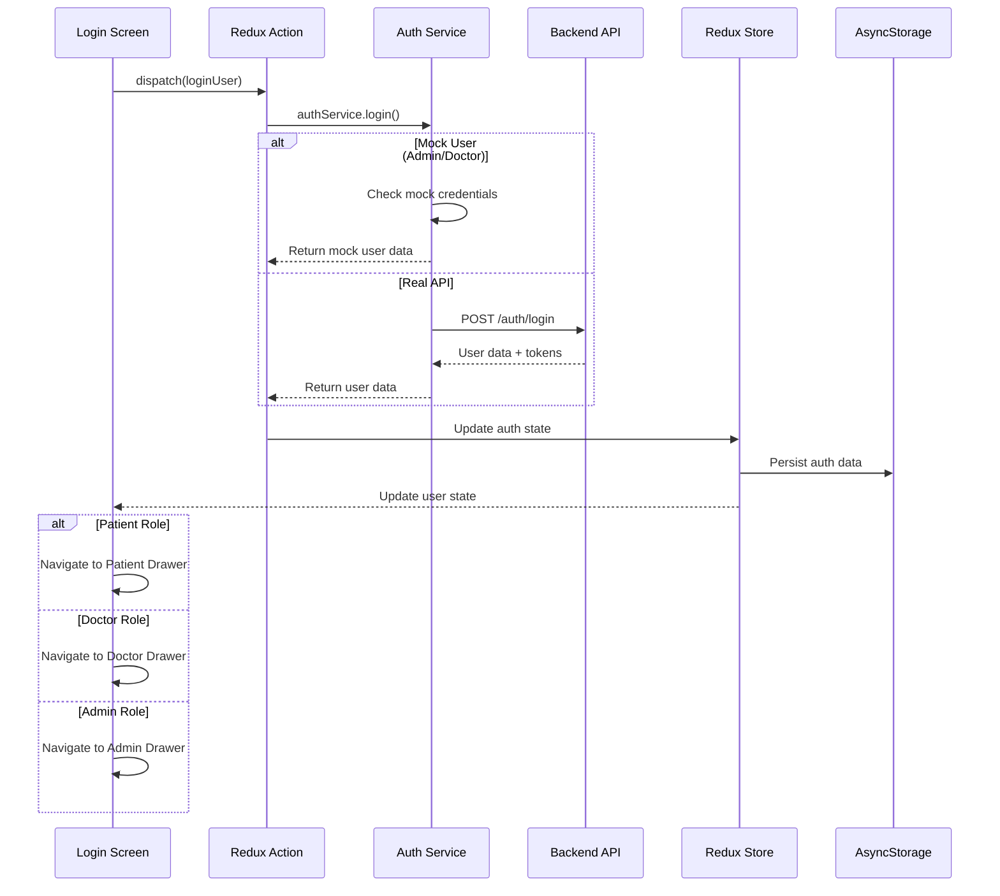

### 4.2 Admin Doctor Verification Flow

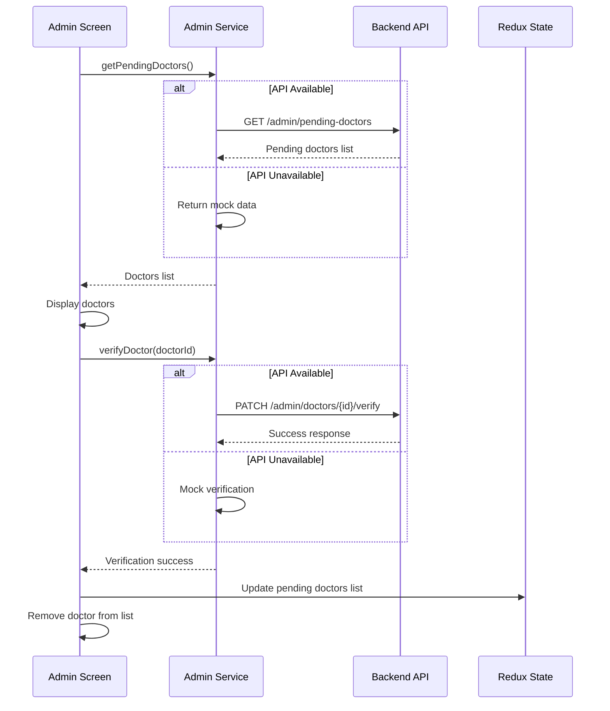

### 4.3 Component Data Flow

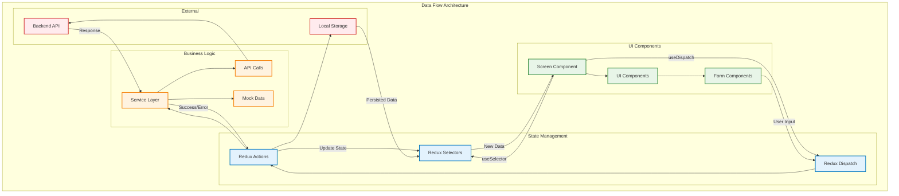

## 5. Security & Performance Diagrams

### 5.1 Security Architecture

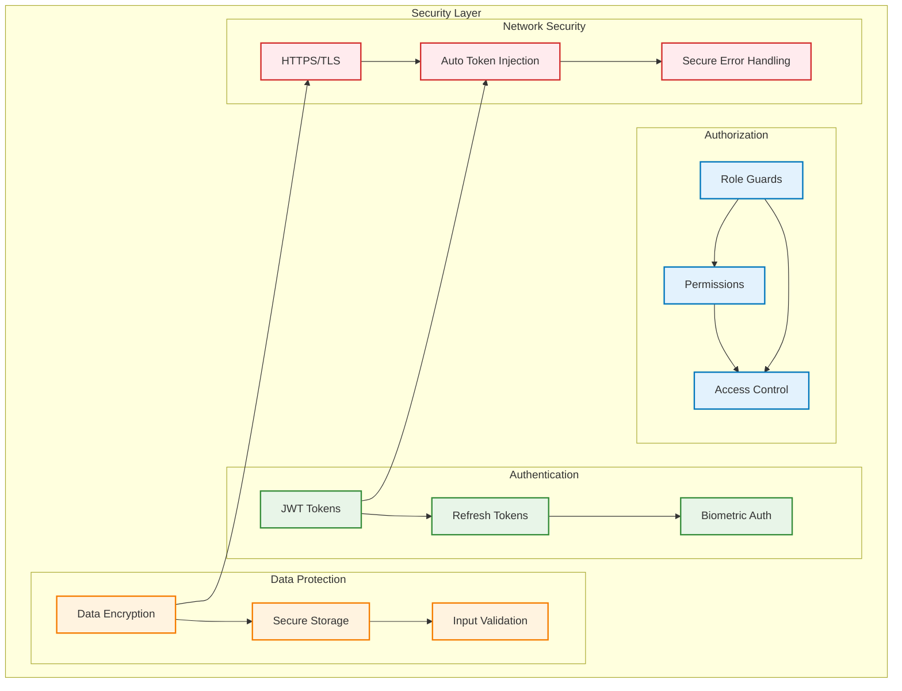

### 5.2 Performance Architecture

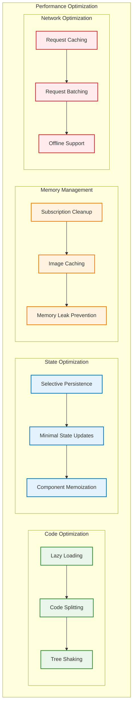

## 6. Integration Architecture

### 6.1 External Service Integration

```mermaid
graph TB
    subgraph "ZenCare Frontend"
        APP[React Native App]
        API_CLIENT[API Client]
        WS_CLIENT[WebSocket Client]
        STORAGE[Local Storage]
    end

    subgraph "Backend Services"
        REST_API[REST API]
        WS_SERVER[WebSocket Server]
        AUTH_SERVICE[Auth Service]
        FILE_SERVICE[File Upload Service]
    end

    subgraph "External APIs"
        PUSH_SERVICE[Push Notification Service]
        MAP_SERVICE[Maps Service]
        PAYMENT_SERVICE[Payment Gateway]
    end

    subgraph "Native Features"
        CAMERA[Camera/Gallery]
        BIOMETRIC_AUTH[Biometric Authentication]
        LOCAL_STORAGE[Device Storage]
        NOTIFICATIONS[Local Notifications]
    end

    APP --> API_CLIENT
    APP --> WS_CLIENT
    APP --> STORAGE

    API_CLIENT --> REST_API
    WS_CLIENT --> WS_SERVER
    API_CLIENT --> AUTH_SERVICE
    API_CLIENT --> FILE_SERVICE

    APP --> PUSH_SERVICE
    APP --> MAP_SERVICE
    API_CLIENT --> PAYMENT_SERVICE

    APP --> CAMERA
    APP --> BIOMETRIC_AUTH
    STORAGE --> LOCAL_STORAGE
    APP --> NOTIFICATIONS

    classDef frontend fill:#e8f5e8,stroke:#388e3c,stroke-width:2px
    classDef backend fill:#e3f2fd,stroke:#0277bd,stroke-width:2px
    classDef external fill:#fff3e0,stroke:#f57c00,stroke-width:2px
    classDef native fill:#ffebee,stroke:#d32f2f,stroke-width:2px

    class APP,API_CLIENT,WS_CLIENT,STORAGE frontend
    class REST_API,WS_SERVER,AUTH_SERVICE,FILE_SERVICE backend
    class PUSH_SERVICE,MAP_SERVICE,PAYMENT_SERVICE external
    class CAMERA,BIOMETRIC_AUTH,LOCAL_STORAGE,NOTIFICATIONS native
```

### 6.2 Component Integration Flow

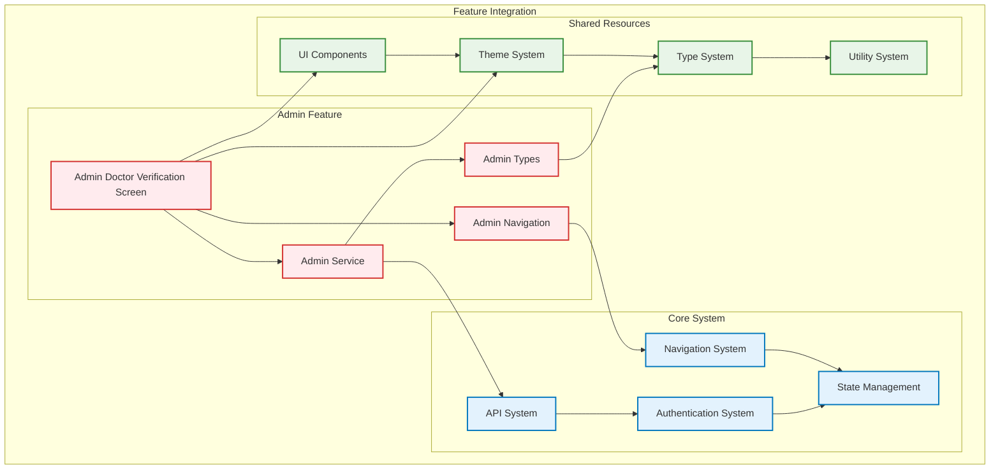

This comprehensive set of Mermaid diagrams covers all aspects of your ZenCare frontend architecture, from the overall system design down to specific implementation details. These diagrams will be perfect for your graduation project book and provide clear visual representations of your application's architecture.
UIComponents["`**UI Components**
• Buttons
• Inputs (OTP, Forms)
• Modals
• Overlays
• Feedback Components`"]

            AuthComponents["`**Auth Components**
            • Login Forms
            • Role Selectors
            • Verification Inputs
            • Registration Forms`"]

            DomainComponents["`**Domain Components**
            • Doctor Cards
            • Appointment Cards
            • Medication Lists
            • Chat Bubbles
            • Prescription Forms`"]

            LayoutComponents["`**Layout Components**
            • Headers
            • Navigation Bars
            • Containers
            • Safe Areas`"]
        end
    end

    %% State Management Layer
    subgraph StateLayer ["`**🗄️ STATE MANAGEMENT LAYER**`"]
        Redux["`**Redux Toolkit Store**
        Centralized State Management`"]

        subgraph Slices ["`**State Slices**`"]
            AuthSlice["`**Auth Slice**
            • User Data
            • Authentication Status
            • Role Management
            • Token Management`"]

            ChatSlice["`**Chat Slice**
            • Message History
            • Active Conversations
            • Online Status
            • Typing Indicators`"]

            OtherSlices["`**Other Slices**
            • Appointments
            • Notifications
            • Settings`"]
        end

        Persistence["`**Redux Persist**
        AsyncStorage Integration
        • Selective Persistence
        • Automatic Rehydration`"]
    end

    %% Service Layer
    subgraph ServiceLayer ["`**🔗 SERVICE LAYER**`"]
        APIClient["`**API Client**
        Axios HTTP Client
        • Base Configuration
        • Request Interceptors
        • Response Interceptors
        • Error Handling`"]

        subgraph Services ["`**API Services**`"]
            AuthService["`**Auth Service**
            • Login/Logout
            • Registration
            • Email Verification
            • Password Reset
            • Token Refresh`"]

            ChatService["`**Chat Service**
            • Send Messages
            • Fetch History
            • WebSocket Connection
            • File Uploads`"]

            DoctorService["`**Doctor Service**
            • Doctor Search
            • Availability
            • Specialties
            • Reviews`"]

            DrugService["`**Drug Service**
            • Medication Search
            • Drug Information
            • Interaction Checks`"]
        end
    end

    %% Utility Layer
    subgraph UtilityLayer ["`**🛠️ UTILITY LAYER**`"]
        Types["`**TypeScript Types**
        • Navigation Types
        • API Response Types
        • Component Props
        • Domain Models`"]

        Utils["`**Utilities**
        • Date Formatting
        • Validation Helpers
        • Image Utilities
        • Constants`"]

        Theme["`**Theme System**
        • Color Palette
        • Typography
        • Spacing
        • Component Styles`"]

        Config["`**Configuration**
        • API URLs
        • Environment Variables
        • Feature Flags`"]
    end

    %% External Services
    subgraph ExternalServices ["`**🌐 EXTERNAL SERVICES**`"]
        BackendAPI["`**ZenCare Backend API**
        RESTful API
        • Authentication
        • User Management
        • Healthcare Data
        • File Upload`"]

        WebSocket["`**Real-time Services**
        WebSocket Connection
        • Live Chat
        • Notifications
        • Status Updates`"]

        NativeServices["`**Native Services**
        • Camera/Gallery
        • Location Services
        • Push Notifications
        • Biometric Auth`"]
    end

    %% Data Flow Connections
    App --> Navigation
    Navigation --> Screens
    Screens --> Components

    Components --> Redux
    Redux --> Slices
    Redux --> Persistence

    Components --> Services
    Services --> APIClient
    APIClient --> BackendAPI
    ChatService --> WebSocket

    Components --> Utils
    Components --> Theme
    Components --> Types
    Services --> Config

    Components --> NativeServices

    %% Bidirectional data flow
    AuthSlice <--> AuthService
    ChatSlice <--> ChatService
    Redux <--> Persistence

    %% Styling for better visualization
    classDef layerStyle fill:#e1f5fe,stroke:#01579b,stroke-width:3px,color:#000
    classDef componentStyle fill:#f3e5f5,stroke:#4a148c,stroke-width:2px,color:#000
    classDef serviceStyle fill:#e8f5e8,stroke:#1b5e20,stroke-width:2px,color:#000
    classDef externalStyle fill:#fff3e0,stroke:#e65100,stroke-width:2px,color:#000

    class PresentationLayer,StateLayer,ServiceLayer,UtilityLayer layerStyle
    class Navigation,Screens,Components,Redux,Slices componentStyle
    class APIClient,Services serviceStyle
    class ExternalServices,BackendAPI,WebSocket,NativeServices externalStyle

````

## Simplified High-Level Architecture Diagram

For a more concise overview, here's a simplified version:

```mermaid
graph TD
    %% Main App
    App["`**ZenCare Mobile App**`"]

    %% Core Layers
    UI["`**🎨 UI Layer**
    Screens & Components`"]

    State["`**🗄️ State Management**
    Redux + Persistence`"]

    API["`**🔗 API Layer**
    Services & HTTP Client`"]

    Backend["`**🌐 Backend Services**
    REST API + WebSocket`"]

    %% Navigation Flow
    subgraph UserFlows ["`**User Flows**`"]
        PatientFlow["`**Patient Journey**
        Register → Browse Doctors → Book → Chat`"]

        DoctorFlow["`**Doctor Journey**
        Register → Verification → Manage Patients → Consult`"]
    end

    %% Key Features
    subgraph Features ["`**Core Features**`"]
        Auth["`**🔐 Authentication**
        Role-based Access Control`"]

        Telemedicine["`**💬 Telemedicine**
        Video Calls & Chat`"]

        Appointments["`**📅 Appointments**
        Booking & Management`"]

        Prescriptions["`**💊 Prescriptions**
        Digital Prescriptions`"]
    end

    %% Connections
    App --> UI
    UI --> State
    UI --> API
    API --> Backend

    App --> UserFlows
    UserFlows --> Features
    Features --> State

    %% Styling
    classDef appStyle fill:#e3f2fd,stroke:#0d47a1,stroke-width:3px
    classDef layerStyle fill:#f1f8e9,stroke:#33691e,stroke-width:2px
    classDef flowStyle fill:#fce4ec,stroke:#880e4f,stroke-width:2px
    classDef featureStyle fill:#fff8e1,stroke:#ff6f00,stroke-width:2px

    class App appStyle
    class UI,State,API,Backend layerStyle
    class UserFlows,PatientFlow,DoctorFlow flowStyle
    class Features,Auth,Telemedicine,Appointments,Prescriptions featureStyle
````

## Data Flow Diagram

```mermaid
sequenceDiagram
    participant U as User
    participant C as Component
    participant S as Redux Store
    participant API as API Service
    participant B as Backend

    Note over U,B: User Authentication Flow

    U->>C: Login Action
    C->>S: Dispatch loginUser()
    S->>API: authService.login()
    API->>B: POST /auth/login
    B-->>API: User Data + Token
    API-->>S: User Object
    S-->>C: Updated Auth State
    C-->>U: Navigate to Dashboard

    Note over U,B: Data Fetching Flow

    U->>C: Load Doctors
    C->>API: doctorService.getDoctors()
    API->>B: GET /doctors
    B-->>API: Doctors List
    API-->>C: Doctors Data
    C-->>U: Display Doctors

    Note over U,B: Real-time Communication

    U->>C: Send Message
    C->>S: Dispatch sendMessage()
    S->>API: chatService.sendMessage()
    API->>B: WebSocket Message
    B-->>API: Message Delivered
    API-->>S: Update Chat State
    S-->>C: New Message State
    C-->>U: Message Sent UI
```

## Usage Instructions

1. **For Documentation**: Copy the first comprehensive diagram code into Mermaid Live Editor
2. **For Presentations**: Use the simplified high-level diagram
3. **For Technical Discussions**: Use the data flow sequence diagram
4. **For Development**: Reference the detailed architecture documentation above

The diagrams are designed to be rendered in Mermaid Live Editor and can be exported as SVG, PNG, or embedded in documentation.
