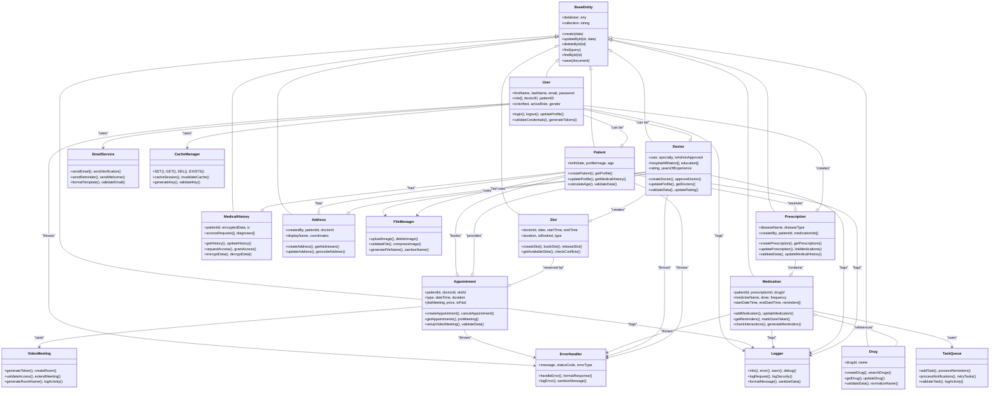

```mermaid
classDiagram
    %% Base Class
    class BaseEntity {
        +database: any
        +collection: string
        +create(data)
        +updateById(id, data)
        +deleteById(id)
        +find(query)
        +findById(id)
        +save(document)
    }

    %% Core User Management
    class User {
        +firstName, lastName, email, password
        +role[], doctorID, patientID
        +isVerified, activeRole, gender
        +login(), logout(), updateProfile()
        +validateCredentials(), generateTokens()
    }

    class Patient {
        +birthDate, profileImage, age
        +createPatient(), getProfile()
        +updateProfile(), getMedicalHistory()
        +calculateAge(), validateData()
    }

    class Doctor {
        +user, specialty, isAdminApproved
        +hospitalAffiliation[], education[]
        +rating, yearsOfExperience
        +createDoctor(), approveDoctor()
        +updateProfile(), getDoctors()
        +validateData(), updateRating()
    }

    %% Appointment System
    class Appointment {
        +patientId, doctorId, slotId
        +type, dateTime, duration
        +jitsiMeeting, price, isPaid
        +createAppointment(), cancelAppointment()
        +getAppointments(), joinMeeting()
        +setupVideoMeeting(), validateData()
    }

    class Slot {
        +doctorId, date, startTime, endTime
        +duration, isBooked, type
        +createSlot(), bookSlot(), releaseSlot()
        +getAvailableSlots(), checkConflicts()
    }

    %% Medical Management
    class Medication {
        +patientId, prescriptionId, drugId
        +medicineName, dose, frequency
        +startDateTime, endDateTime, reminders[]
        +addMedication(), updateMedication()
        +getReminders(), markDoseTaken()
        +checkInteractions(), generateReminders()
    }

    class Prescription {
        +diseaseName, diseaseType
        +createdBy, patientId, medicationIds[]
        +createPrescription(), getPrescriptions()
        +updatePrescription(), linkMedications()
        +validateData(), updateMedicalHistory()
    }

    class Drug {
        +drugId, name
        +createDrug(), searchDrugs()
        +getDrug(), updateDrug()
        +validateData(), normalizeName()
    }

    class MedicalHistory {
        +patientId, encryptedData, iv
        +accessRequests[], diagnoses[]
        +getHistory(), updateHistory()
        +requestAccess(), grantAccess()
        +encryptData(), decryptData()
    }

    %% Supporting Classes
    class Address {
        +createdBy, patientId, doctorId
        +displayName, coordinates
        +createAddress(), getAddresses()
        +updateAddress(), geocodeAddress()
    }

    class VideoMeeting {
        +generateToken(), createRoom()
        +validateAccess(), extendMeeting()
        +generateRoomName(), logActivity()
    }

    class EmailService {
        +sendEmail(), sendVerification()
        +sendReminder(), sendWelcome()
        +formatTemplate(), validateEmail()
    }

    class TaskQueue {
        +addTask(), processReminders()
        +processNotifications(), retryTasks()
        +validateTask(), logActivity()
    }

    class ErrorHandler {
        +message, statusCode, errorType
        +handleError(), formatResponse()
        +logError(), sanitizeMessage()
    }

    class Logger {
        +info(), error(), warn(), debug()
        +logRequest(), logSecurity()
        +formatMessage(), sanitizeData()
    }

    class FileManager {
        +uploadImage(), deleteImage()
        +validateFile(), compressImage()
        +generateFileName(), sanitizeName()
    }

    class CacheManager {
        +SET(), GET(), DEL(), EXISTS()
        +cacheSession(), invalidateCache()
        +generateKey(), validateKey()
    }

    %% Inheritance
    BaseEntity <|-- User
    BaseEntity <|-- Patient
    BaseEntity <|-- Doctor
    BaseEntity <|-- Appointment
    BaseEntity <|-- Slot
    BaseEntity <|-- Medication
    BaseEntity <|-- Prescription
    BaseEntity <|-- Drug
    BaseEntity <|-- MedicalHistory
    BaseEntity <|-- Address

    %% Core Relationships
    User --o Patient : "can be"
    User --o Doctor : "can be"
    Doctor --o Slot : "creates"
    Patient --o Appointment : "books"
    Doctor --o Appointment : "provides"
    Slot --o Appointment : "reserved by"
    Patient --o Prescription : "receives"
    User --o Prescription : "creates"
    Prescription --o Medication : "contains"
    Medication o-- Drug : "references"
    Patient --o MedicalHistory : "has"
    Patient --o Address : "has"
    Doctor --o Address : "has"

    %% Service Dependencies
    Appointment --> VideoMeeting : "uses"
    Medication --> TaskQueue : "uses"
    User --> EmailService : "uses"
    User --> CacheManager : "uses"
    Doctor --> FileManager : "uses"
    Patient --> FileManager : "uses"

    %% Error & Logging
    User --> ErrorHandler : "throws"
    Appointment --> ErrorHandler : "throws"
    Medication --> ErrorHandler : "throws"
    Doctor --> ErrorHandler : "throws"
    Patient --> ErrorHandler : "throws"

    User --> Logger : "logs"
    Appointment --> Logger : "logs"
    Medication --> Logger : "logs"
    Doctor --> Logger : "logs"
    Patient --> Logger : "logs"
``` 